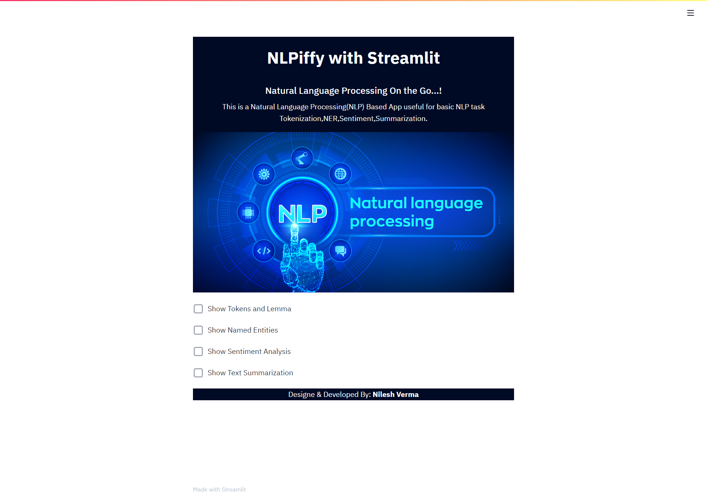
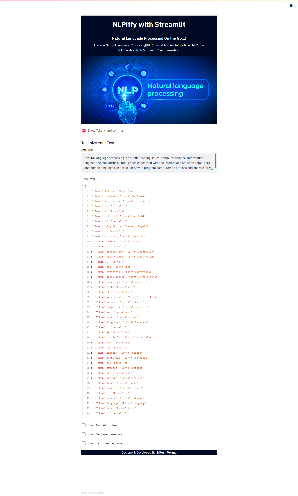
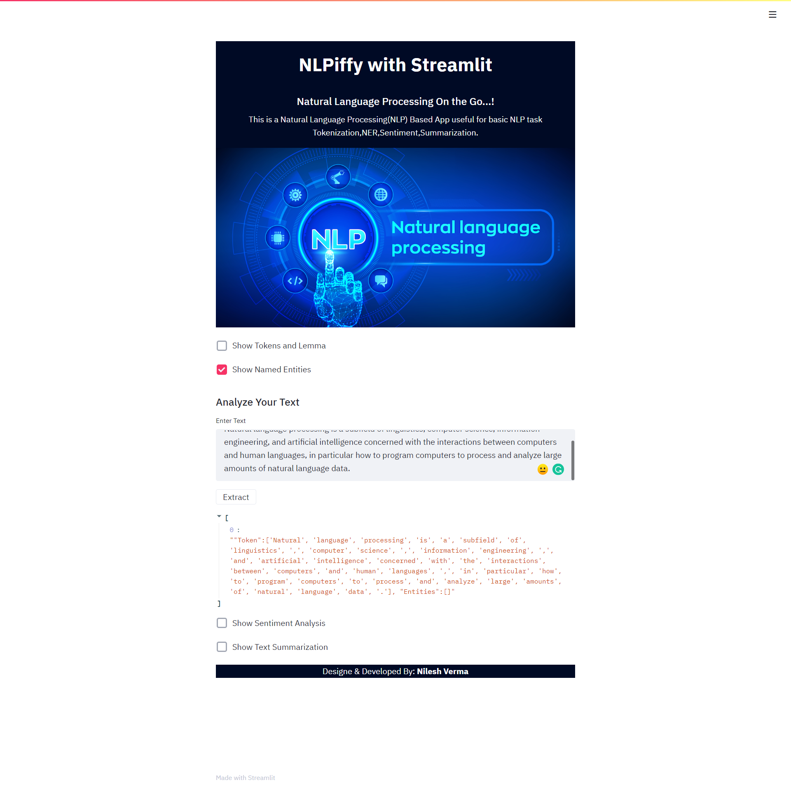
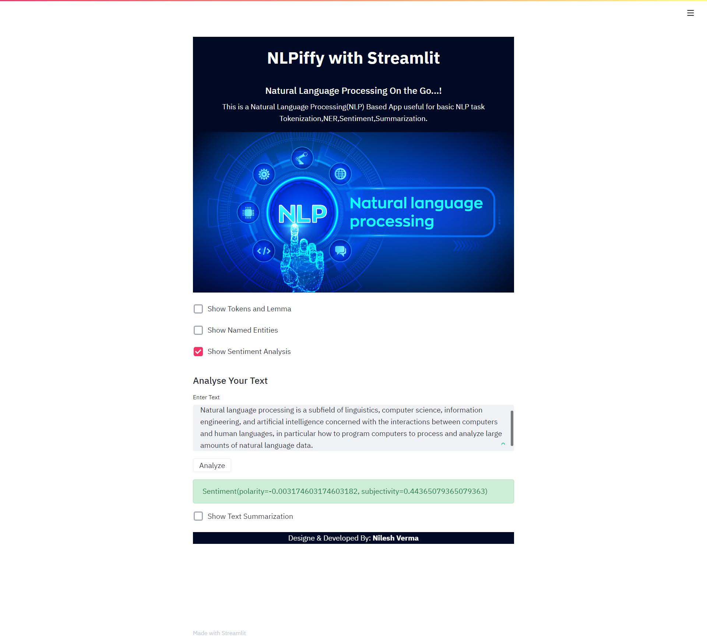
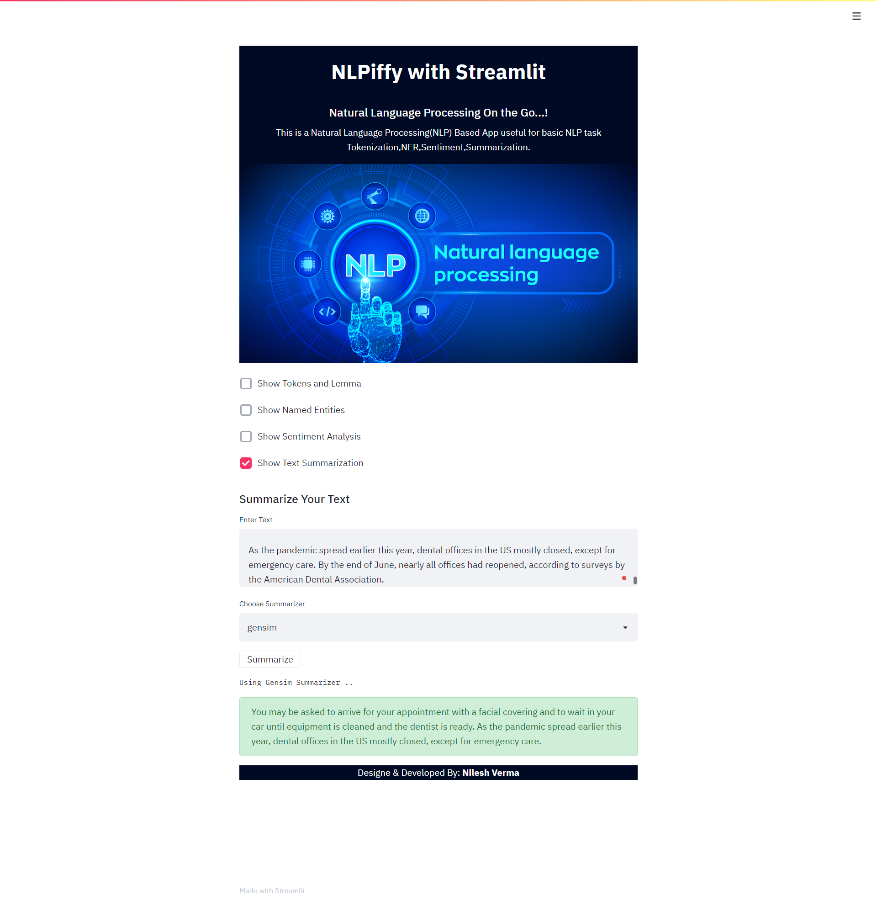

## NLP Based App with Streamlit
   
+ (NLPiffy) -Natural Language Processing on the Go

#### Description
+ A NLP app built with streamlit framework using SpaCy for Named Entity Extraction(NER) and tokenization, TextBlob for sentiment analysis and Gensim and Sumy for text summarization

#### To Run the App
```bash
streamlit run app.py
```
## Link
https://nlpiffy.herokuapp.com/

#### NLP App



#### Tokenization


#### Entity Extraction with Spacy


#### Sentiment Analysis


#### Text Summarization with Sumy/Gensim



#### By
+ Nilesh Verma(@techynilesh)
